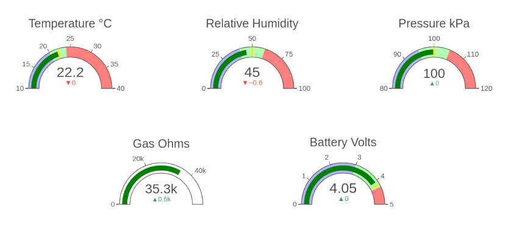
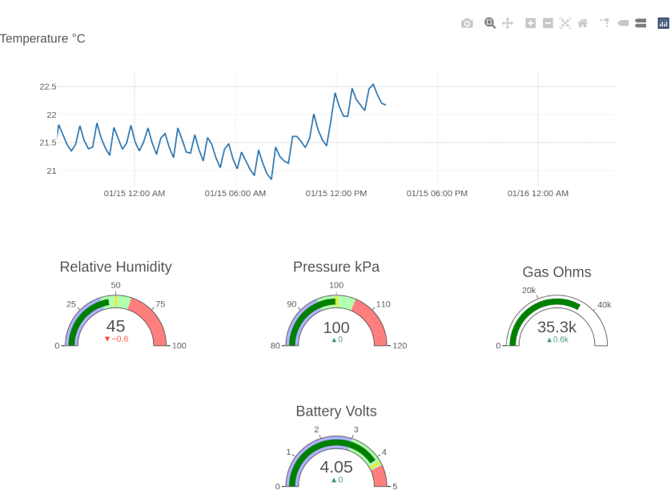

How to Chart the Data from a Bluetooth Low Energy Environmental Sensor
----------------------------------------------------------------------

This project shows you how to use [Plotly](https://plotly.com/javascript/) to chart data from my 
[Bluetooth Low Energy Environmental Sensor](https://github.com/patrickmoffitt/zephyr_ble_sensor). These data are stored
in a SQLite database by my [Bluetooth Low Energy Sensor Service](https://github.com/patrickmoffitt/ble_sensor_service) 
project. I've also provided a a [CGI](https://github.com/patrickmoffitt/ble_sensor_cgi) so you can RESTfully query the 
data into Plotly in JSON format. When the page loads it will show the following:



Clicking on a gauge replaces it with an interactive strip chart.



The page is mobile responsive so it works as well on phones and tablets as it does on a desktop.

Configuring the Web Root
------------------------
-1. As root, make the directory `/var/www/html/ble_sensor` and copy the following files and folders
into it:
- css/
- js/
- index.html
- favicon.ico

-2. Fix the ownership, group, and permissions.
```bash
sudo mkdir /var/www/html/ble_sensor
cd /var/www/html/ble_sensor
sudo chown -R www-data:www-data
sudo find . -type f -exec chmod 0644 {} \;
sudo find . -type d -exec chmod 0755 {} \;
```

-3. When you're done `/var/www/html/ble_sensor` will contain:
```bash
ls -al /var/www/html/ble_sensor
total 64
drwxr-xr-x 4 root root  4096 Jan 15 14:41 .
drwxr-xr-x 7 root root  4096 Dec  5 17:50 ..
drwxr-xr-x 2 root root  4096 Dec  1 09:31 css
-rw-r--r-- 1 root root 42366 Jan 15 12:03 favicon.ico
-rw-r--r-- 1 root root  1124 Jan 15 14:41 index.html
drwxr-xr-x 2 root root  4096 Dec 29 19:18 js
```

-4. You can now test the configuration by pointing your browser to http://your_server/ble_sensor

Bugs, Issues, and Pull Requests
------------------------------
If you find a bug please create an issue. If you'd like to contribute please send a pull request.

References
----------
The following were helpful references in the development of this project.

- [Plotly JavaScript Figure Reference](https://plotly.com/javascript/reference/index/)
